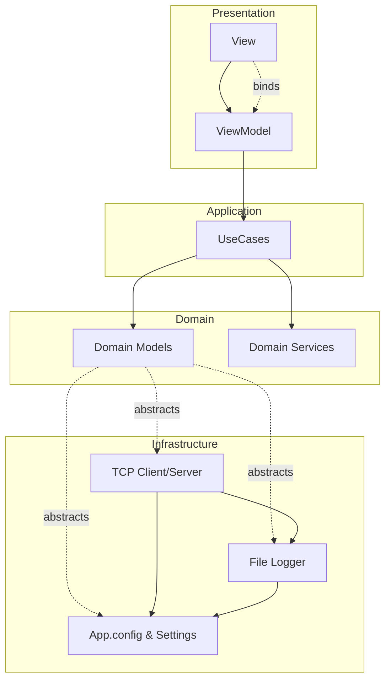
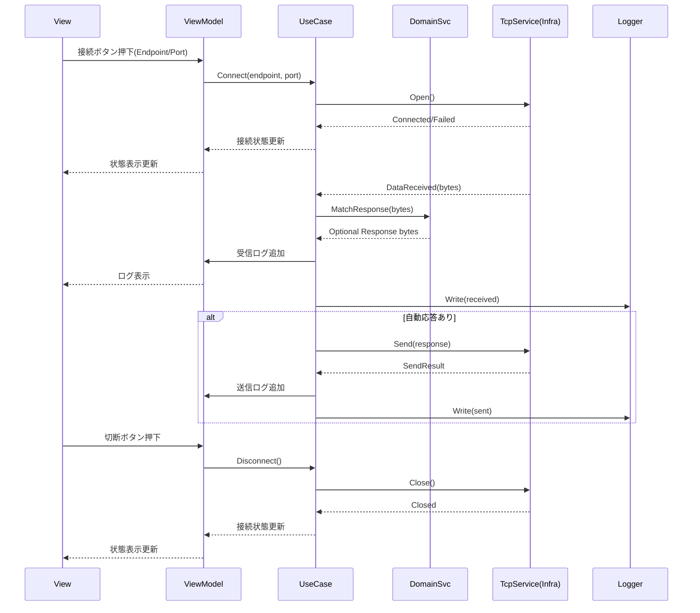

# 要件定義書（MVVM + クリーンアーキテクチャ準拠）

## 1. 背景・目的

- 既存プロジェクトの対抗ツール/シミュレータとして、TCP ソケット通信でサーバー/クライアントとやり取りし、そのログを UI に可視化する。
- オペレーターが接続先や自動応答を柔軟に設定し、接続・切断・送受信の状態を安全に把握できることを目的とする。

## 2. スコープ

- Windows (.NET Framework 4.8.1、WPF) 向けデスクトップアプリ。
- TCP クライアント/サーバーの双方を想定したシミュレーション操作とログ閲覧。
- 自動応答（受信メッセージに対する事前定義の返信）の設定と実行。
- 接続先 IP アドレス/ポートの設定、接続・切断の操作、状態表示。
- 送受信データのログ表示・保存。
- 外部オープンソースパッケージは原則使用しない（標準ライブラリ範囲で実装）。

## 3. 利用者/ユースケース

- **オペレーター**: 接続先を指定し、接続/切断を操作。ログを監視。手動送信や自動応答設定を変更。
- **開発/検証担当**: 相手機器やサーバーの挙動検証のため、シミュレーション条件を変更し動作確認。

## 4. 機能要件

- **接続設定**
  - IP アドレス、ポート番号の入力・保存。
  - 接続/切断ボタンで TCP 接続を開始/終了。
  - 接続状態（接続中/切断/再接続中など）の表示。
- **送受信**
  - 任意テキスト/バイナリ（16 進文字列入力を想定）を送信できる UI。
  - 受信データをリアルタイムにログへ追加表示。
  - 文字コード設定（UTF-8/Shift_JIS など）を選択可能にする（送信/表示に適用）。
- **自動応答**
  - 受信内容に対して事前定義ルール（マッチ条件と返信内容）を設定・有効/無効化。
  - ルールは優先度付きリストとして管理。
- **ログ**
  - 時刻・方向（送信/受信）・内容・接続先を含む行として表示。
  - フィルタ（期間、方向、文字列一致）とクリア機能。
  - ファイル保存（テキスト/CSV）と手動エクスポート。
- **シミュレーション制御**
  - 自動送信シナリオ（一定間隔送信など）の設定と開始/停止。
  - タイムアウト/リトライ回数の設定。
- **エラーハンドリング/通知**
  - ソケット例外や送受信失敗時に UI へ明示的に表示（メッセージとステータス）。
  - 再接続オプション（自動再接続の有効/無効と間隔設定）。

## 5. 非機能要件

- **性能**: 通常の業務利用で UI がフリーズしないこと（ネットワーク処理は非 UI スレッドで実装）。
- **信頼性**: 接続断時は明確なステータスを表示し、ログが失われないようバッファ管理。
- **操作性**: 設定・ログ・送受信操作を 1 画面または明確なタブで完結できる。
- **保守性**: MVVM + クリーンアーキテクチャで UI とドメイン/インフラを分離。依存方向は UI → アプリケーションサービス → ドメイン → インフラの一方向。
- **セキュリティ**: 保存する設定に認証情報を含めない想定。必要に応じて暗号化や資格情報管理を後続検討。
- **外部依存**: オープンソースパッケージ非使用。標準ライブラリで完結。

## 6. 画面/UX 要件（WPF）

- 接続設定パネル（IP、ポート、接続/切断、ステータス表示）。
- 送信パネル（テキスト/16 進入力、送信ボタン、文字コード選択、自動送信設定）。
- 自動応答設定パネル（ルール一覧、追加/編集/削除、優先度並べ替え）。
- ログビュー（スクロール、フィルタ、クリア、保存）。
- ステータスバー（接続状態、送受信件数、エラー有無）。

## 7. データ項目

- 接続設定: `EndpointIp`, `Port`, `AutoReconnectEnabled`, `AutoReconnectIntervalSec`, `TimeoutMs`, `RetryCount`。
- 送信設定: `Encoding`, `PayloadText`, `PayloadHex`, `AutoSendIntervalSec`。
- 自動応答ルール: `Id`, `Name`, `MatchType`（完全一致/部分一致/正規表現/バイナリ）, `Pattern`, `Response`, `Enabled`, `Priority`。
- ログ: `Timestamp`, `Direction`（Send/Receive）, `Endpoint`, `Content`, `ErrorInfo`（任意）。

## 8. 例外・エラー処理

- 接続失敗/切断/タイムアウト/送受信失敗時は UI に明示。再試行や設定見直しを促すメッセージ。
- 不正な IP/ポート、エンコード不能データ入力は送信前にバリデーション。

## 9. 設定・永続化

- アプリ設定（接続先、文字コード、タイムアウト、リトライ、ログ保存先など）は `App.config` またはユーザー設定に保存。
- ログ保存先はユーザー選択可能で、保存時にファイルパス確認。

## 10. アーキテクチャ指針

- **パターン**: MVVM + クリーンアーキテクチャ。
- **層**: Presentation(WPF) → Application(UseCase/Service) → Domain(エンティティ/バリューオブジェクト) → Infrastructure(TCP, 設定, 永続化)。
- **依存性**: 上位層が下位の抽象に依存し、インフラはインターフェース実装として差し込む。
- **テスト容易性**: 通信インターフェースの抽象化によりモックでのユースケーステストを可能にする。

## 11. 運用・ログ

- アプリ内ログ表示に加え、必要に応じてファイル出力。ローテーションは後続検討。
- 例外発生時にデバッグ情報（例外種別、メッセージ、スタックトレースの要約）を内部ログへ残す。

## 12. 今後の拡張余地（任意）

- TLS 対応、認証付き接続、プロトコルスクリプト化、複数接続の同時管理、バイナリエディタ風 UI、シナリオ実行の記録と再生。

## 13. レイヤー別の責務詳細（MVVM + クリーンアーキテクチャ）

- **Presentation (WPF/MVVM)**
  - View: XAML で UI を定義。イベントやコマンドを ViewModel へバインド。
  - ViewModel: Bindable な状態と ICommand を公開し、Application 層のユースケースを呼び出す。UI スレッド調整（Dispatcher）を行う。
  - バリデーション: 入力の基本バリデーション（IP/ポート形式、必須チェック）を実施し、詳細な業務ルールは下位層へ委譲。
  - ログ表示/通知: ログやステータス更新を ObservableCollection 等で公開。
- **Application（ユースケース/サービス）**
  - ユースケース: 接続開始/終了、送信、受信処理の開始/停止、自動応答設定 CRUD、ログ保存などをオーケストレーション。
  - ポリシー: タイムアウト、リトライ、再接続、送信間隔などの制御ポリシーを保持し、Domain のルールを用いて判断。
  - 変換: ViewModel の DTO と Domain モデルの相互変換を担当。
  - 抽象依存: Domain インターフェース（リポジトリ/サービス）に依存し、Infrastructure 実装は知らない。
- **Domain（エンティティ/バリューオブジェクト/サービス）**
  - 接続設定、送信設定、自動応答ルール、ログレコード等の不変条件を保持するモデル。
  - ドメインサービス: マッチングロジック、エンコード/デコード判定、再接続判定などの純粋ロジックを提供。
  - ルール: IP/ポートの範囲チェック、エンコード可能性の検証、ルール優先度の解決など。
  - 依存: 下位技術詳細（ソケット API やファイル IO）には依存しない。
- **Infrastructure（技術詳細）**
  - 通信: TCP クライアント/サーバー実装（非同期送受信、切断検知、再接続トリガー、エンコード/デコード）。
  - 永続化/設定: App.config への保存/読込、ログファイル出力、ユーザー設定の保存。
  - 実装: Application/Domain のインターフェースを実装し、例外をドメイン適合エラーへ変換。
- **Cross-cutting（共通関心事）**
  - ロギング: UI 表示用と内部診断用を分離。必要に応じてファイル出力。
  - エラーハンドリング: 例外を層ごとにハンドリングし、ユーザーには要約を提示。詳細は内部ログへ。
  - スレッド/同期: UI スレッドとバックグラウンド処理の切り分け（Dispatcher、Task 等）。

## 14. 図（Mermaid）

### レイヤー構成

### 接続-送受信-自動応答の基本シーケンス

## 15. 設定ファイル（XML）要件
- **目的**: 接続設定・送信設定・自動応答ルール・ログ保存設定などを XML で保存/読込し、UI から確認・変更・保存できるようにする。
- **形式**: 独自 XML（標準ライブラリで処理、外部ライブラリ非使用）。将来的に XSD によるバリデーションを追加できる構造にする。
- **ファイル入出力**:
  - 読込: UI からファイル選択（既定パス候補を表示）。読込結果を画面に反映し、差分がある場合は上書き確認。
  - 保存: 現在の設定を「上書き保存」と「名前を付けて保存」で実施。書き込み失敗時は理由を表示。
  - バリデーション: 必須項目（IP/Port/Encoding/Timeout 等）の存在と型チェック。ルール重複や優先度重複の警告。
  - 互換性: 不明な要素/属性は無視して読込（拡張性確保）。バージョン属性を持たせ、今後の変更に備える。
- **UI 表示/編集**:
  - 接続設定・送信設定・自動応答ルール・ログ保存先をタブ/パネルに展開し、XML 由来の内容を一覧・編集可能にする。
  - 自動応答ルールは一覧表示＋詳細編集（優先度の上げ下げ、ON/OFF）。
  - 読込後に「未保存の変更」状態をわかるように表示。
- **XML モデル例（概略）**:
  - ルート: `<TcpToolConfig version="1.0">`
    - `<Endpoint ip="127.0.0.1" port="9000" autoReconnect="true" autoReconnectIntervalSec="5" timeoutMs="5000" retryCount="3" />`
    - `<SendSettings encoding="UTF-8" autoSendIntervalSec="0" />`
    - `<AutoResponses>` 複数の `<Rule id="" name="" enabled="" priority="">` を保持
      - 属性/子要素: `matchType`（Exact/Contains/Regex/Binary）、`pattern`、`response`（hex/text を区別する属性を追加）
    - `<Logging path="logs\\tcp.log" enabled="true" />`
  - 将来的な拡張余地として `<Scenarios>` や `<Tls>` ブロックを追加できる構造にする。
- **実装指針**:
  - Domain 層に設定モデルを定義し、Application で XML 変換（XmlSerializer または XDocument）を行う。
  - UI では ViewModel が設定 DTO を保持し、読込/保存コマンドを公開。ファイルダイアログは Infrastructure に置く。
  - 例外発生時は要約を UI に提示し、詳細は内部ログへ記録。
